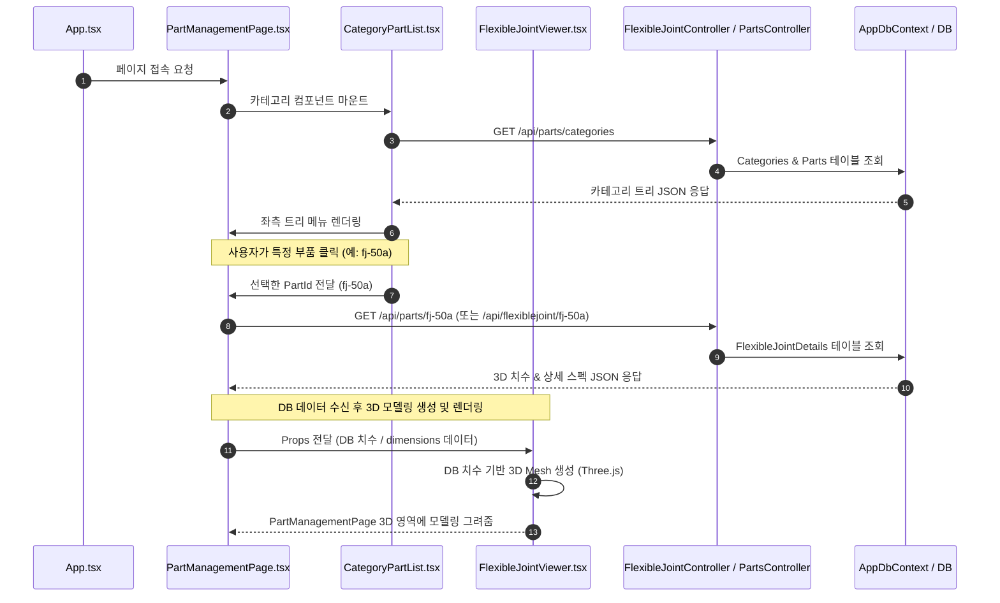

# PartManagementPage.tsx 전체 실행 순서도 (Flowchart)

## 1. 텍스트형 실행 순서도 (Code Block)

> **노트**: 아래 상자는 고정폭 폰트(Text Block)로 감싸져 있어 저장해도 모양이 깨지지 않습니다.

```text
[ 프론트엔드 (React) ]
  1. App.tsx (라우팅 및 페이지 요청)
        │
        ▼
  2. PartManagementPage.tsx (부품 관리 메인 페이지)
        │
        ▼
  3. CategoryPartList.tsx (좌측 부품 카테고리 메뉴)
        │
        │  HTTP GET: /api/parts/categories (메뉴 트리 데이터 요청)
        └───────────────────────────────┐
                                        ▼
================================================================
[ 백엔드 (ASP.NET Core) ]
                                4. Program.cs (라우터 배정)
                                        │
                                        ▼
                                5. PartsController.cs (GetMenuCategories)
                                        │
                                        ▼
                                6. AppDbContext.cs (Entity 매핑 및 LINQ)
                                        │
                                        ▼
                                7. Database (SQL 쿼리 실행 및 데이터 조회)
================================================================
                                        │
                                 [ 역방향 응답 (Response: JSON) ]
                                        │
  8. CategoryPartList.tsx ◄─────────────┘ (트리 메뉴 화면 출력)
        │
        ▼ (사용자가 특정 부품 클릭: 예 - fj-50a)
  9. PartManagementPage.tsx (선택한 PartId 수신)
        │
        │  HTTP GET: /api/parts/fj-50a (부품 상세 치수 요청)
        └───────────────────────────────┐
                                        ▼
================================================================
                                10. FlexibleJointController.cs (또는 PartsController)
                                        │
                                        ▼
                                11. AppDbContext.cs (FlexibleJointDetails 테이블 조회) ──► DB
================================================================
                                        │
                                 [ 역방향 응답 (3D 치수 & 스펙 JSON) ]
                                        │
 12. PartManagementPage.tsx ◄───────────┘ (상세 데이터 수신)
        │
        ▼ (Props 전달: DB에서 받아온 dimensions 및 스펙 데이터)
 13. FlexibleJointViewer.tsx (3D 뷰어 컴포넌트)
        │
        ├─► 수신한 DB 치수를 기반으로 Three.js 3D Mesh / Geometry 연산 생성
        │
        ▼
 14. PartManagementPage.tsx (3D 메인 영역 내에 3D 모델링 최종 렌더링 출력)
```

---

## 2. 그래픽 다이어그램 (Mermaid)

> VS Code에서 `Ctrl + Shift` -> `V` (마크다운 미리보기)를 누르면 비주얼 시퀀스 다이어그램 그래픽으로 변환되어 나타납니다.


